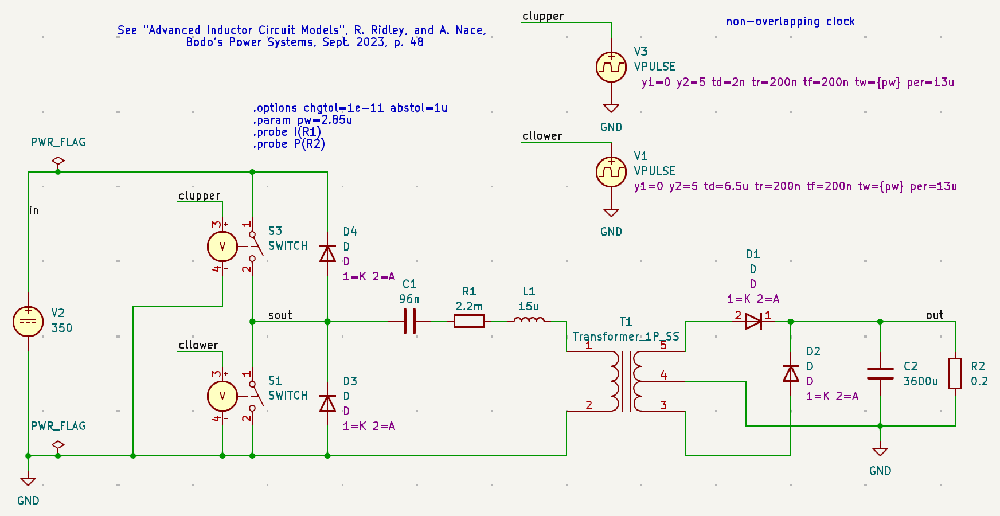
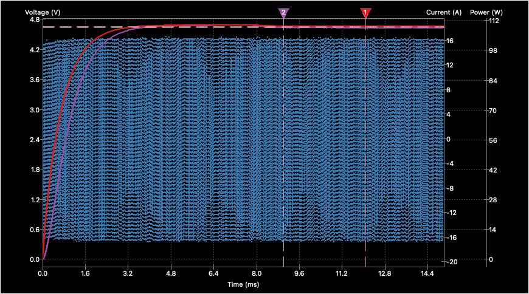

## LLC Converter
The next one is a resonant LLC converter:

## Schematics

## Transient Analysis

The look is a little ugly, as for the lack of a voltage controlled switch symbol I have used relay symbols. But there are ngspice switch models attached to these symbols!
