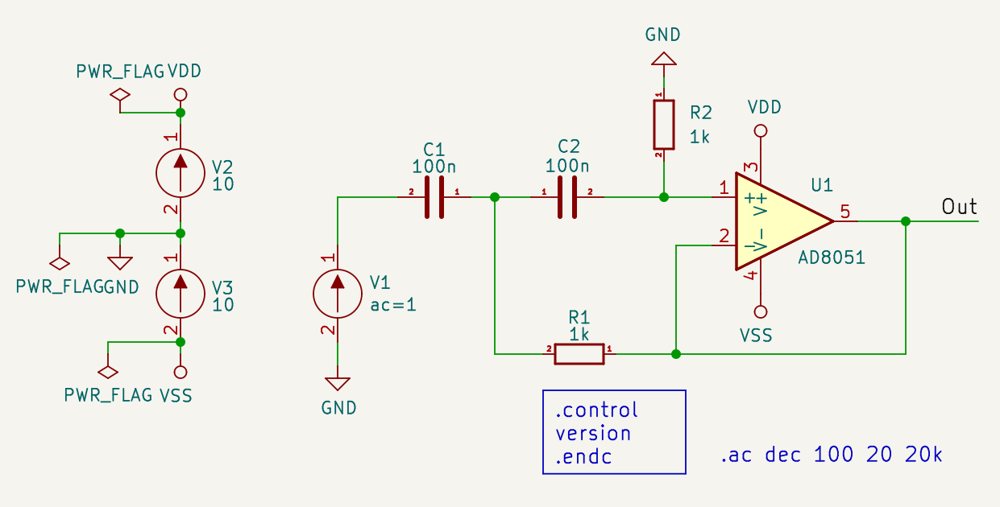
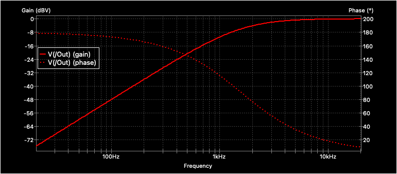

# Sallen-Key high-pass Filter

## Resources
* [Wikipedia](https://en.wikipedia.org/wiki/Sallen%E2%80%93Key_topology#Application:_high-pass_filter)
* [Sallen-Key High-pass Filter Design Tool](http://sim.okawa-denshi.jp/en/OPseikiHikeisan.htm)

## Schematics

## Gain/Phase Plot

[Original design (lpf)](https://gitlab.com/kicad/code/kicad/-/tree/master/demos/simulation/sallen_key)
