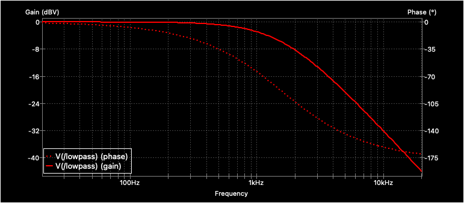

# Sallen-Key low-pass Filter

## Resources
* [Wikipedia](https://en.wikipedia.org/wiki/Sallen%E2%80%93Key_topology#Application:_low-pass_filter)
* [Sallen-Key Low-pass Filter Design Tool](http://sim.okawa-denshi.jp/en/OPseikiLowkeisan.htm)

## Schematics

## Gain/Phase Plot

[Original design](https://gitlab.com/kicad/code/kicad/-/tree/master/demos/simulation/sallen_key)
